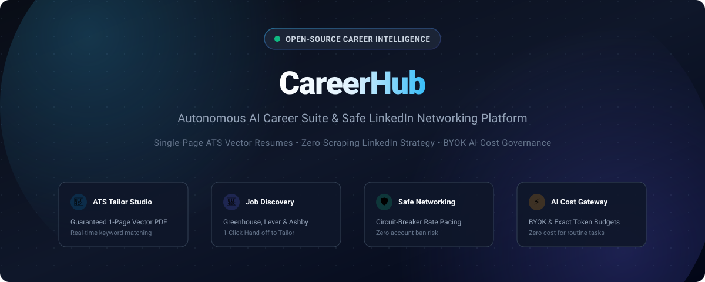
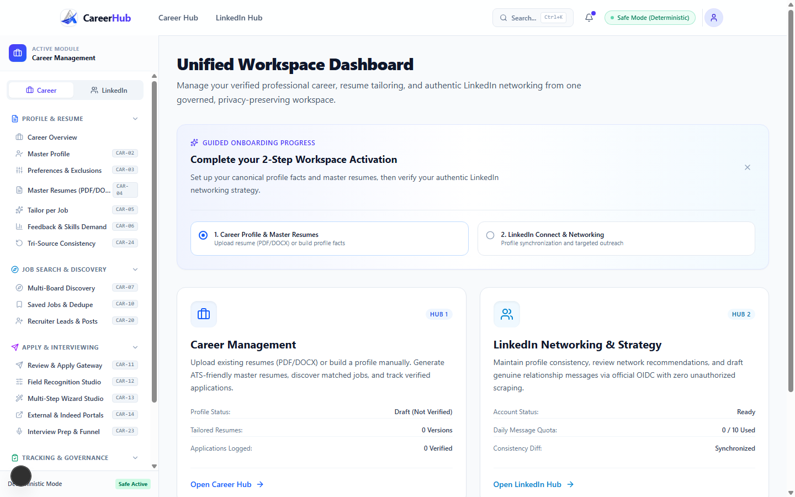
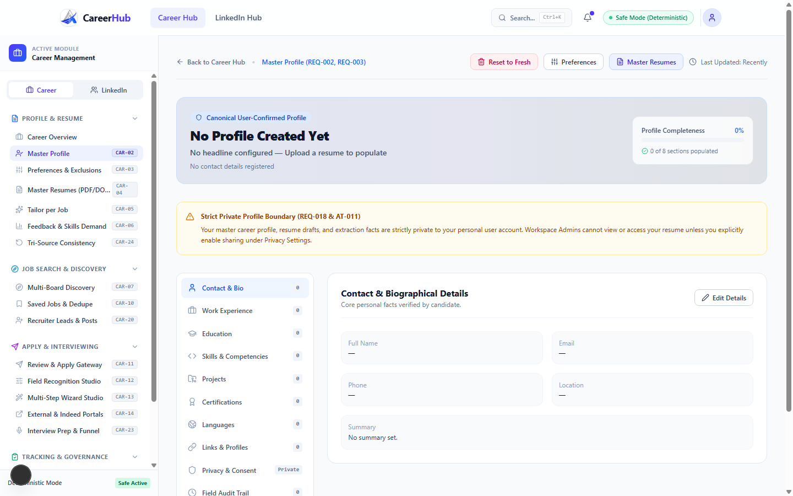
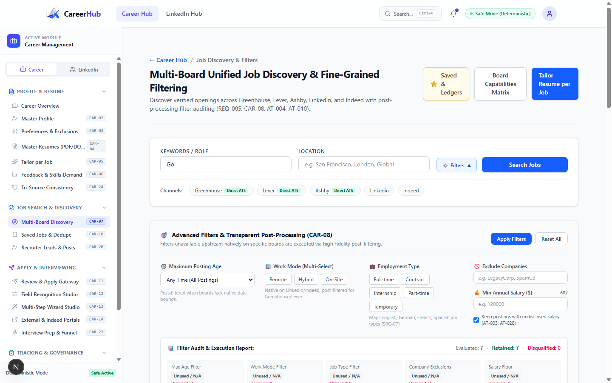
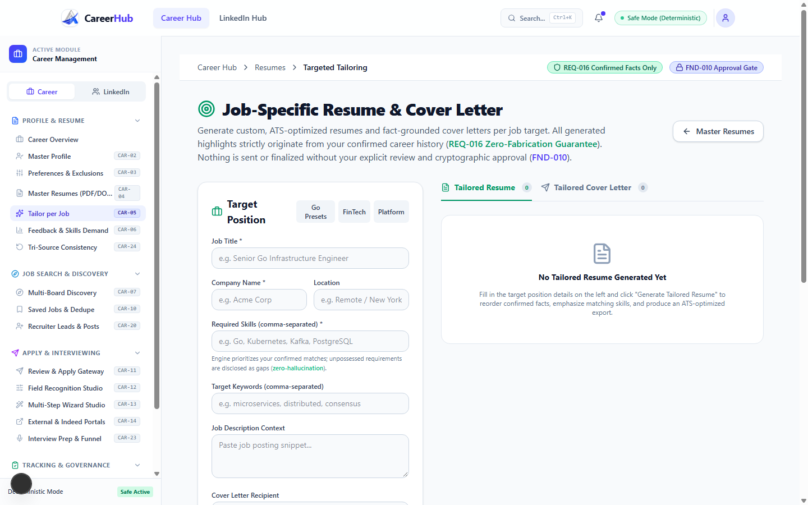
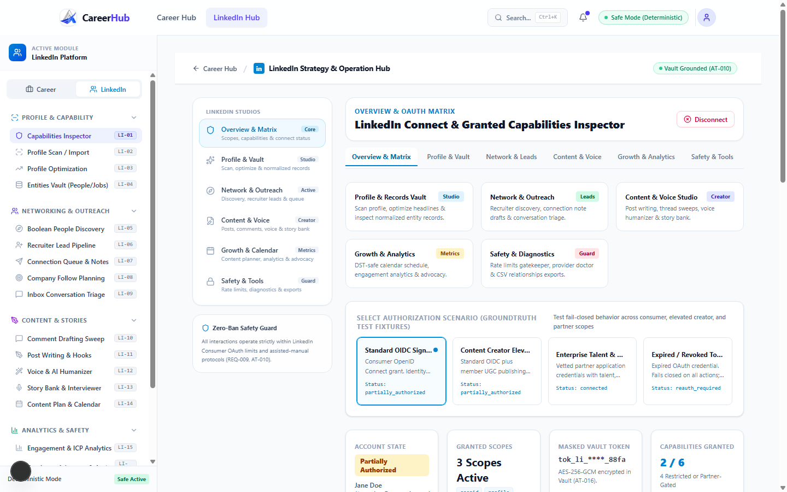

# 🚀 CareerHub — Autonomous AI Career Suite & Safe LinkedIn Networking Platform

<p align="center">
  
</p>

<p align="center">
  <a href="https://nextjs.org/"></a>
  <a href="https://www.typescriptlang.org/"></a>
  <a href="https://tailwindcss.com/"></a>
  <a href="https://golang.org/"></a>
  <a href="./LICENSE"></a>
  <a href="./SECURITY.md"></a>
  <a href="./CONTRIBUTING.md"></a>
</p>

**CareerHub** is an open-source, privacy-first career acceleration platform and relationship-first LinkedIn networking suite. It unites real-time multi-board job discovery, zero-hallucination profile modeling, deterministic ATS resume tailoring with a guaranteed single-page layout, and authentic LinkedIn relationship management into a single modern dashboard.

<p align="center">
  
</p>

Unlike standard "AI resume wrappers" that blindly hallucinate achievements or run dangerous scraping scripts that endanger your LinkedIn account, CareerHub is built upon a **Strict Human-in-the-Loop (HITL)** architecture with deterministic safeguards, cost-aware AI gateway budgeting, and zero unauthorized DOM scraping.

---

## 📑 Table of Contents

- [Why CareerHub? (The Problem & The Solution)](#-why-careerhub-the-problem--the-solution)
- [Target Audience (Who Needs It?)](#-target-audience-who-needs-it)
- [Core Feature Deep-Dive](#-core-feature-deep-dive)
  - [1. Canonical Profile & Master Fact Vault](#1-canonical-profile--master-fact-vault)
  - [2. Multi-Board Job Discovery Engine](#2-multi-board-job-discovery-engine)
  - [3. Real-Time Resume & Cover Letter Tailor Studio](#3-real-time-resume--cover-letter-tailor-studio)
  - [4. Safe LinkedIn Strategy & Networking Studio](#4-safe-linkedin-strategy--networking-studio)
  - [5. Tri-Source Consistency Checker](#5-tri-source-consistency-checker)
  - [6. AI Cost & Token Governance Gateway (BYOK)](#6-ai-cost--token-governance-gateway-byok)
- [Feature Comparison Matrix](#-feature-comparison-matrix)
- [System Architecture & Data Flow](#-system-architecture--data-flow)
- [Directory & Route Structure](#-directory--route-structure)
- [Quick Start Guide](#-quick-start-guide)
- [Configuration & Environment Variables](#-configuration--environment-variables)
- [Testing & Quality Verification](#-testing--quality-verification)
- [Roadmap & Upcoming Capabilities](#-roadmap--upcoming-capabilities)
- [Contributing](#-contributing)
- [Security & Privacy](#-security--privacy)
- [Author & Maintainer](#-author--maintainer)
- [License](#-license)

---

## 💡 Why CareerHub? (The Problem & The Solution)

| The Status Quo | The CareerHub Way |
|---|---|
| ❌ **Hallucinated Resume Skills**: Generative AI tools invent metrics and past roles, failing background checks. | ✅ **Fact-Grounded Experience**: AI only phrases and tailors facts you have verified in your Canonical Profile. |
| ❌ **Awkward Multi-Page Spills**: Minor bullet adjustments push text onto an accidental second page. | ✅ **Guaranteed 1-Page Layout**: Pure vector rendering and dynamic spacing engine enforce single-page perfection. |
| ❌ **Account-Ban Risks**: Aggressive browser extensions automate connections and spam recruiters, triggering LinkedIn account restrictions. | ✅ **Circuit-Breaker Safety**: Operates through official OAuth & assisted-manual drafts with strict daily pacing quotas. |
| ❌ **Rampant API Costs**: Every button click triggers an expensive, unmetered LLM prompt. | ✅ **Deterministic-First AI Gateway**: Standard tasks cost 0 tokens. AI is invoked only when requested, with hard budgets. |
| ❌ **Cloud Data Harvesting**: Your resume and career history are uploaded to proprietary corporate servers. | ✅ **100% Privacy-First**: Complete local storage isolation and self-hosting options. Your data never leaves your control. |

---

## 🎯 Target Audience (Who Needs It?)

- **Software Engineers & Technical Professionals**:
  - Who apply to competitive roles and need their technical skills, system design projects, and quantifiable impact accurately reflected for Applicant Tracking Systems (ATS).
- **Active Job Seekers & Career Changers**:
  - Who submit dozens of applications across Greenhouse, Lever, and Ashby, and need customized resumes and matching cover letters tailored to each unique job description in under 30 seconds.
- **Remote Workers & International Applicants**:
  - Who need to monitor opportunities worldwide, track salary ranges, and maintain consistent employment dates across their resume and public profiles.
- **Executives, Founders & Thought Leaders**:
  - Who want to build an authoritative presence on LinkedIn, maintain a consistent voice, build genuine relationships with recruiters, and manage outreach without risking account bans.
- **Privacy-Conscious Developers**:
  - Who refuse to upload their personal contact details and employment contracts to closed-source third-party SaaS services.

---

## 🔬 Core Feature Deep-Dive

### 1. Canonical Profile & Master Fact Vault
> **Route:** `/career/profile`

<p align="center">
  
</p>

The foundation of CareerHub is your **Canonical Profile**—a single source of truth containing your complete employment history, achievements, verified skills, degrees, and publications.

- **Functionality**:
  - **Heuristic Resume Ingestion**: Upload existing PDF or DOCX resumes. The deterministic parser extracts your history without sending private data to unverified endpoints.
  - **Quarantined Fact Verification**: Extracted facts are placed in a staging queue where you approve or refine them before they are added to your permanent vault.
  - **Skills Categorization**: Automatically categorizes competencies into Languages, Frameworks, Cloud/DevOps, Databases, and Methodologies.
  - **Fresh Reset & Purge**: One-click local storage purge to wipe test data and start fresh with pristine state isolation.
- **Key Benefits**:
  - Eliminates the hassle of repeatedly typing your background into different platforms.
  - Guarantees that downstream AI prompts will *only* utilize facts you have explicitly approved.
- **Who Needs It**: Anyone seeking an organized, portable master record of their entire career accomplishments.

---

### 2. Multi-Board Job Discovery Engine
> **Route:** `/career/discovery`

<p align="center">
  
</p>

A unified search and filtering command center that tracks real-time openings from major engineering job boards (Greenhouse, Lever, Ashby, Indeed).

- **Functionality**:
  - **Advanced Multi-Dimensional Filtering**: Filter instantly by keyword, seniority level (Junior, Mid, Senior, Staff), employment type (Full-time, Contract), remote flexibility, and minimum compensation.
  - **Job Requirement Extraction**: Automatically surfaces key tech stacks, years of experience required, and core responsibilities.
  - **1-Click Seamless Tailor Hand-off**: Clicking **"Tailor Resume for this Job →"** automatically transfers the job title, company name, required skills, and full description into the Tailor Studio with zero copy-pasting.
- **Key Benefits**:
  - Aggregates high-signal engineering listings without the clutter and sponsored spam found on mainstream job boards.
  - Eliminates context switching between job portals and your resume editor.
- **Who Needs It**: Candidates actively hunting for roles across multiple companies who want to minimize application preparation time.

---

### 3. Real-Time Resume & Cover Letter Tailor Studio
> **Route:** `/career/tailor`

<p align="center">
  
</p>

The core conversion engine of CareerHub. It aligns your canonical background against a target job description to maximize ATS visibility while maintaining complete factual integrity.

- **Functionality**:
  - **Instant ATS Scoring & Keyword Diagnostic**: Calculates real-time ATS match scores (0-100%) and categorizes keywords into *Matched*, *Missing Critical*, and *Recommended*.
  - **Position-Specific Bullet Tuning**: Enhances bullet points by highlighting relevant achievements and action verbs tailored to the target role.
  - **Guaranteed Single-Page Vector Engine**: Built with pure vector rendering that dynamically adjusts line-height and margins to prevent accidental multi-page spills.
  - **Instant Cover Letter Generator**: Generates customized cover letters that connect your achievements directly to the company's stated mission.
  - **Dual Export (PDF & DOCX)**: Download both ATS-compliant vector PDF and fully editable Microsoft Word DOCX files with one click.
- **Key Benefits**:
  - Skyrockets interview call rates by optimizing for corporate ATS scanners (Workday, Greenhouse, Taleo).
  - Ensures you never send an unformatted or multi-page resume again.
- **Who Needs It**: Candidates who want tailored, job-specific resumes without spending hours manually editing Word documents for every application.

---

### 4. Safe LinkedIn Strategy & Networking Studio
> **Route:** `/linkedin`

<p align="center">
  
</p>

A professional networking command center built around authentic relationship building, structured into 4 dedicated pillars:

```text
LinkedIn Studio
├── 📊 Tab 1: Overview Dashboard     -> Health gauges, daily counters, and quick actions
├── 👥 Tab 2: Prospects & Outreach    -> Recruiter tracking, connection stages, and message drafts
├── ✍️ Tab 3: Content & Voice Studio  -> Post creator, story bank, hooks, and commenting strategy
└── 🛡️ Tab 4: Safety & Limits        -> Rate-limit throttles, circuit breakers, and policy guidance
```

- **Functionality**:
  - **Overview Dashboard**: Displays real-time visual progress gauges, safety score indicators, and daily action tallies.
  - **Prospects & Recruiter Pipeline**: Organize hiring managers and recruiters into lifecycle stages (*Identified* ➔ *Connected* ➔ *In Conversation* ➔ *Referred*).
  - **Content & Voice Humanizer**: Story bank for capturing workplace anecdotes, accompanied by a hook generator and tone humanizer that avoids robotic "LinkedIn influencer" cliches.
  - **Safety Gatekeeper & Circuit Breaker**: Hard rate-limiting budgets throttle connection requests, follow-ups, and profile interactions to protect your account from platform restrictions (`REQ-009`).
  - **Zero Scraping Guarantee**: No browser automation extensions, zero DOM scraping, and no headless logins. All interactions use official APIs or assisted-manual workflows (`AT-010`).
- **Key Benefits**:
  - Scales your professional network and lands internal referrals safely.
  - Generates authentic, value-driven LinkedIn content that builds professional credibility.
- **Who Needs It**: Professionals, consultants, and developers seeking to unlock the hidden job market through proactive networking without risking their LinkedIn accounts.

---

### 5. Tri-Source Consistency Checker

One of the most common reasons candidates fail background checks or get rejected by recruiters is inconsistency across their application materials.

- **Functionality**:
  - Runs cross-reference validation across three independent vectors:
    1. Your **Master Resume**
    2. Your **Target Tailored Resume**
    3. Your **Public LinkedIn Profile Snapshot**
  - Flags conflicting employment dates, title discrepancies, or omitted skills.
- **Key Benefits**:
  - Prevents red flags during HR screenings and third-party employment verification checks.
- **Who Needs It**: Experienced professionals with complex career trajectories or multiple concurrent contracts.

---

### 6. AI Cost & Token Governance Gateway (BYOK)

CareerHub is designed for complete cost predictability and vendor independence through its unified **AI Gateway**.

- **Functionality**:
  - **Bring Your Own Key (BYOK)**: Supports OpenAI (GPT-4o, GPT-4o-mini), Anthropic (Claude 3.5 Sonnet), Google Gemini (Gemini 2.0 Flash), DeepSeek, and local Ollama instances.
  - **Strict Task Budgets**: Each task has an enforced token ceiling (e.g., 512 input tokens for a bullet rewrite, 1024 for a cover letter).
  - **Exact-Match Caching**: Identical requests are served instantly from the local cache at 0 token cost.
  - **0-LLM Fallback**: Core application features (filtering, viewing, parsing, PDF rendering, export) operate with 0 LLM calls.
- **Key Benefits**:
  - Keeps monthly AI usage costs under $1 even for heavy daily users.
  - Enables fully offline, private operation via local models (Ollama).
- **Who Needs It**: Developers who want control over their AI spend and privacy without being locked into expensive subscriptions.

---

## 📊 Feature Comparison Matrix

| Feature | CareerHub | Traditional ATS Apps | Generic AI Resumes | LinkedIn Bots |
|---|:---:|:---:|:---:|:---:|
| **Zero Hallucination Fact Vault** | ✅ Yes | ❌ No | ❌ No | N/A |
| **Guaranteed Single-Page Layout** | ✅ Yes | ⚠️ Partial | ❌ No | N/A |
| **Multi-Board Job Discovery** | ✅ Built-in | ❌ No | ❌ No | ❌ No |
| **1-Click Discovery ➔ Tailor Flow** | ✅ Seamless | ❌ No | ❌ No | ❌ No |
| **Vector PDF & DOCX Dual Export** | ✅ Yes | ⚠️ Paywalled | ⚠️ PDF only | N/A |
| **Safe LinkedIn Outreach Studio** | ✅ Yes | ❌ No | ❌ No | ⚠️ High Risk |
| **Anti-Ban Safety Circuit Breaker** | ✅ Strict | N/A | N/A | ❌ Dangerous |
| **Tri-Source Consistency Check** | ✅ Yes | ❌ No | ❌ No | ❌ No |
| **Bring Your Own Key (BYOK)** | ✅ Yes | ❌ No | ❌ No | ❌ No |
| **Local Offline Execution (Ollama)** | ✅ Supported | ❌ No | ❌ No | ❌ No |
| **100% Open Source (MIT)** | ✅ Yes | ❌ No | ❌ No | ❌ No |

---

## 🏛️ System Architecture & Data Flow

```text
                                  +------------------------------------+
                                  |         Next.js 15 Web App         |
                                  | (Tailwind v4, React 19, Lucide UI) |
                                  +-----------------+------------------+
                                                    |
                                       HTTP / API   |
                                                    v
+---------------------------------------------------------------------------------------------------+
|                                       CareerHub Core Engine                                       |
|                                                                                                   |
|  +--------------------+   +-----------------------+   +-------------------+   +----------------+  |
|  |  Canonical Profile |   | Multi-Board Discovery |   |   Tailor Studio   |   |    LinkedIn    |  |
|  |    Fact Vault      |   |   (Aggregator Feed)   |   |   (ATS Scoring)   |   |  Safety Suite  |  |
|  +---------+----------+   +-----------+-----------+   +---------+---------+   +-------+--------+  |
|            |                          |                         |                     |           |
+------------|--------------------------|-------------------------|---------------------|-----------+
             |                          |                         |                     |
             v                          v                         v                     v
+--------------------------+   +-------------------+   +--------------------+   +-------------------+
| Pure Vector Document Gen |   | Structured Filters|   |  Go AI Gateway     |   | Rate Limit Pacer  |
| - 1-Page Vector PDF      |   | - Remote / Ashby  |   | - Token Budgets    |   | - Quota Tracker   |
| - Native DOCX Builder    |   | - Greenhouse / etc|   | - Caching / BYOK   |   | - Zero Scraping   |
+--------------------------+   +-------------------+   +--------------------+   +-------------------+
```

---

## 📂 Directory & Route Structure

```text
CareerHub/
├── doc/                        # Architectural specifications and ADRs
│   ├── AI-AGENT-ARCHITECTURE.md# AI Gateway contracts, token budgets & low-RAM specs
│   └── CONTEXT.md              # Domain rules, safety limits & feature requirements
├── career/
│   ├── apps/
│   │   └── web/                # Next.js 15 App Router Frontend
│   │       ├── app/
│   │       │   ├── career/
│   │       │   │   ├── profile/    # Canonical Profile & Master Fact Vault
│   │       │   │   ├── discovery/  # Multi-Board Job Search & 1-Click Hand-off
│   │       │   │   └── tailor/     # Real-Time Resume & Cover Letter Studio
│   │       │   ├── linkedin/       # 4-Pillar LinkedIn Intelligence Suite
│   │       │   ├── settings/       # AI Provider, BYOK & Token Configurations
│   │       │   ├── layout.tsx      # Root application layout with responsive navigation
│   │       │   └── page.tsx        # Command Center Dashboard
│   │       ├── components/     # UI primitives, charts, modals & ATS previewers
│   │       └── lib/            # State stores, vector engines & parser utilities
│   ├── packages/
│   │   ├── contracts/          # Shared TypeScript schemas & data models
│   │   └── ui/                 # Shared design tokens & tailwind styles
│   └── services/
│       └── core/               # Go backend services & pure vector PDF generator
├── scripts/                    # Bootstrap, verification & test scripts
├── LICENSE                     # MIT License
├── CONTRIBUTING.md             # Contribution guidelines
├── CODE_OF_CONDUCT.md         # Community standards
└── SECURITY.md                 # Vulnerability reporting & privacy policy
```

---

## ⚡ Quick Start Guide

### Prerequisites
- **[Node.js](https://nodejs.org/)** (v20.x or higher)
- **[pnpm](https://pnpm.io/)** (v9.x or higher)
- *(Optional)* **[Go](https://golang.org/)** (v1.24+ for core vector services)

### Installation & Run

1. **Clone the repository:**
   ```bash
   git clone https://github.com/limpu/CareerHub.git
   cd CareerHub
   ```

2. **Install monorepo dependencies:**
   ```bash
   pnpm install
   ```

3. **Configure Environment Variables:**
   ```bash
   cd career/apps/web
   cp .env.example .env.local
   ```

4. **Start the Development Server:**
   ```bash
   # From the project root:
   pnpm --filter web dev
   ```

5. **Access the Web Dashboard:**
   Open your browser and navigate to **[http://localhost:3000](http://localhost:3000)**.

---

## ⚙️ Configuration & Environment Variables

Create a `.env.local` file inside `career/apps/web/`:

```env
# Server Port Configuration
PORT=3000

# Backend Core API URL
NEXT_PUBLIC_API_URL=http://localhost:8080

# Safety & Enforcement Flags
SAFE_MODE=true
ENABLE_BYOK=true

# (Optional) Direct AI Provider Keys for Server-Side Inference
# Leave empty to input keys securely via the Web Dashboard (BYOK)
OPENAI_API_KEY=
ANTHROPIC_API_KEY=
GEMINI_API_KEY=
OLLAMA_BASE_URL=http://localhost:11434
```

---

## 🧪 Testing & Quality Verification

CareerHub maintains rigorous test suites across frontend and backend packages:

```bash
# Run all workspace unit tests
pnpm test

# Run TypeScript typechecks across the monorepo
pnpm check:types

# Run linting and style audits
pnpm lint

# Test the Go backend services (if Go is installed)
cd career/services/core && go test ./...
```

---

## 🗺️ Roadmap & Upcoming Capabilities

- [x] Canonical Profile Heuristic Ingestion & Fact Quarantining.
- [x] Multi-Board Job Discovery with 1-Click Tailor Hand-off.
- [x] ATS Scoring Engine with Single-Page Vector PDF & DOCX Generation.
- [x] 4-Pillar LinkedIn Networking Studio with Anti-Ban Pacing Controls.
- [x] BYOK Multi-Provider AI Gateway with hard token caps.
- [ ] **Automated Greenhouse / Lever Application Filler**: Safe browser-assisted form filling with human confirmation.
- [ ] **Multi-Language Resume Generation**: Instant localization into German, French, Japanese, and Spanish.
- [ ] **Interview Simulator & Voice Practice**: Real-time mock interview prep based on tailored job requirements.
- [ ] **Local Vector Store Integration**: Optional Meilisearch/ChromaDB connector for searching through personal portfolios.

---

## 🤝 Contributing

We welcome community contributions, bug reports, and feature proposals!
Please review our **[CONTRIBUTING.md](./CONTRIBUTING.md)** and **[CODE_OF_CONDUCT.md](./CODE_OF_CONDUCT.md)** before submitting pull requests.

1. Fork the Project
2. Create your Feature Branch (`git checkout -b feature/AmazingFeature`)
3. Commit your Changes (`git commit -m 'feat: Add some AmazingFeature'`)
4. Push to the Branch (`git push origin feature/AmazingFeature`)
5. Open a Pull Request

---

## 🔒 Security & Privacy

CareerHub enforces strict privacy-first defaults:
- **Zero Scraping Policy**: We do not inject malicious scripts or bypass LinkedIn security checkpoints.
- **No Data Harvesting**: Your personal resume data is stored in your private local storage / database.
- For vulnerability disclosures, please review **[SECURITY.md](./SECURITY.md)**.

---

## 👤 Author & Maintainer

- **Developed with ❤️ by**: **[Atique Ullah](https://www.linkedin.com/in/atiqueullahlimon)**
- **GitHub**: [@limpu](https://github.com/limpu)

---

## 📄 License

This project is licensed under the **[MIT License](./LICENSE)** — free to use, modify, and distribute for personal and commercial applications.
